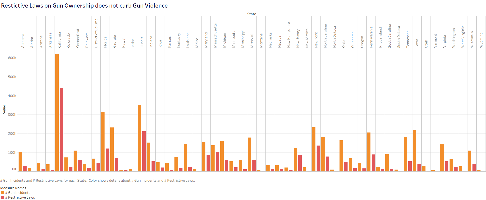
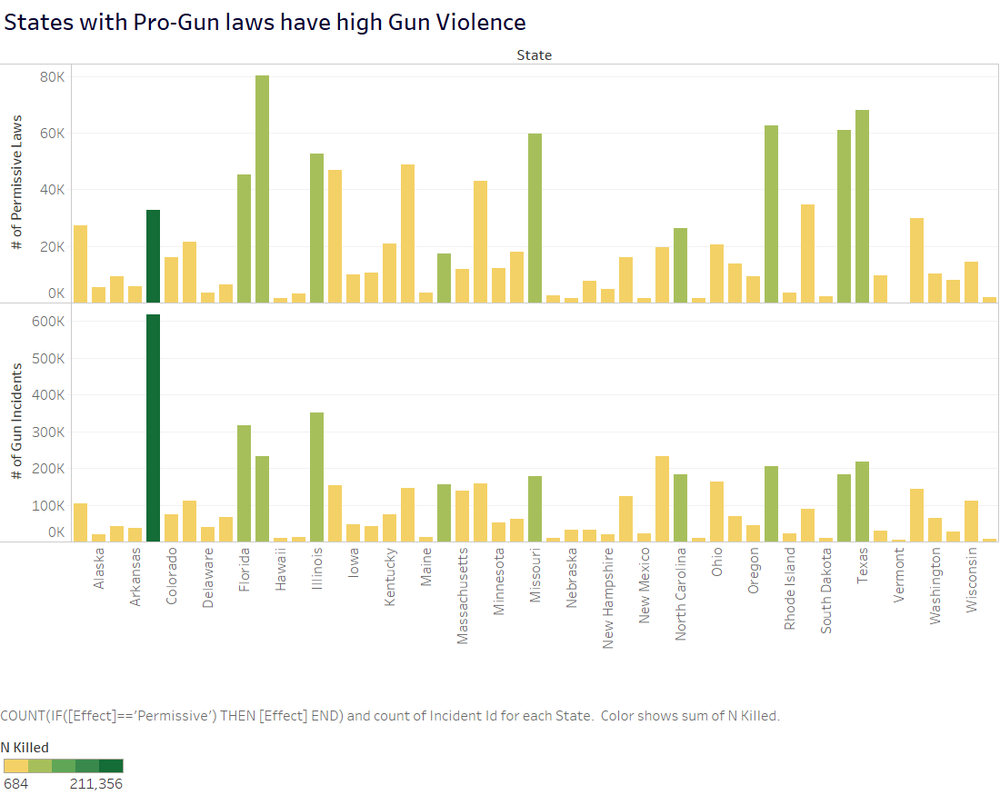

# Argumentative Visualization

### Gun Ownership and Gun Violence

Datasets:
1.   [US Gun Violence Data](https://www.kaggle.com/jameslko/gun-violence-data)
The CSV file contains data for all recorded gun violence incidents in the US between January 2013 and March 2018, inclusive. 

2.  [US Gun Law Data](https://www.rand.org/pubs/tools/TL283.html)
A longitudinal data set of state firearm laws that is free to the public, including  other researchers, to support improved analysis and understanding of the effects of various laws.

Both the datasets have been used in conjunction for the 2 visualizations generated using Tableau.

